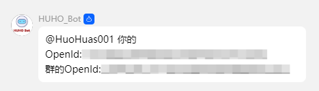

# 管理员帮助

|  命令 | 功能 | 权限 |
|  --- | --- | --- |
|/查信息|查询自己的信息|任何人|
|/查管理 \{openid\}|查询此人是否有管理|管理员|
|/加管理 \{openid\}|为本群添加该管理|管理员|
|/删管理 \{openid\}|为本群删除该管理|管理员|

## 什么是OpenId?
OpenId 是系统为每个用户生成的唯一识别码（形如`6183AB...`），功能上类似于QQ号的唯一标识作用，但实际采用机器人从[QQ开放平台](https://q.qq.com/)获取到的字符串格式，与用户真实的QQ号码无关联。

## 获取OpenId
在任意群内输入`/查信息`即可输出当前用户的OpenId和当前群聊的OpenId.

如图:

## 我能获取QQ号吗？
玩家绑定后，在任意群内输入`/查信息 <OpenId>`即可查询对应的QQ号，同时会输出绑定的QQ号。
