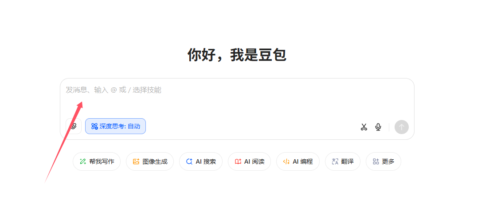
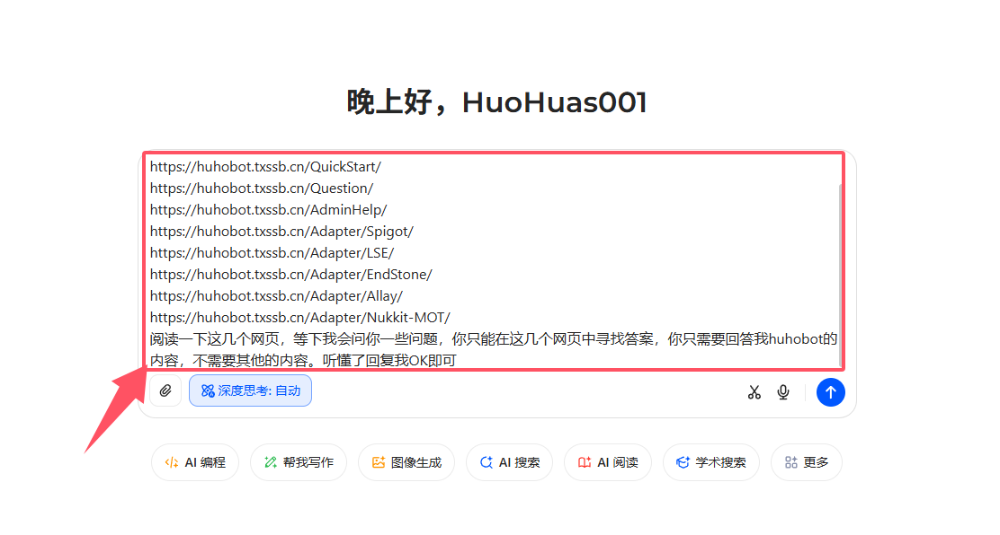
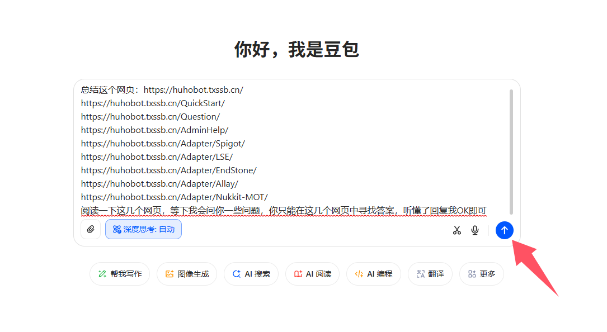

# 询问AI
- 本次使用的是[豆包Doubao](https://www.doubao.com/)

# 进行初始化
1. 打开[豆包Doubao](https://www.doubao.com/)官网，找到输入框


2. 在对话框内写入以下文本
```
总结这个网页：https://huhobot.txssb.cn/
https://huhobot.txssb.cn/QuickStart/
https://huhobot.txssb.cn/Question/
https://huhobot.txssb.cn/AdminHelp/
https://huhobot.txssb.cn/Adapter/Spigot/
https://huhobot.txssb.cn/Adapter/LSE/
https://huhobot.txssb.cn/Adapter/EndStone/
https://huhobot.txssb.cn/Adapter/Allay/
https://huhobot.txssb.cn/Adapter/Nukkit-MOT/
阅读一下这几个网页，等下我会问你一些问题，你只能在这几个网页中寻找答案，你只需要回答我huhobot的内容，不需要其他的内容。听懂了回复我OK即可
```
`注：请全部复制进去，不要只复制一部分，如下图所示`


3. 点击发送按钮


4. 咨询你想问的问题

`出现以下图片则证明已经阅读文本完毕，请在下方对话框内咨询你想问的问题`
