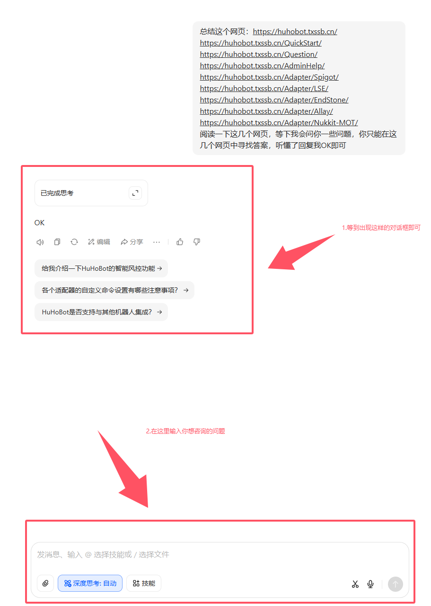

# 🤖 使用AI助手查询HuHoBot文档

## 🌐 使用说明
本次AI查询服务基于[豆包Doubao](https://www.doubao.com/)实现，可快速获取HuHoBot相关文档信息。

## 🚀 初始化步骤

### 1. 访问豆包官网
打开[豆包Doubao官网](https://www.doubao.com/)  


### 2. 输入初始化指令

将以下内容 **完整复制** 到对话框：

```markdown
总结这个网页：https://huhobot.txssb.cn/
https://huhobot.txssb.cn/QuickStart/
https://huhobot.txssb.cn/Question/
https://huhobot.txssb.cn/AdminHelp/
https://huhobot.txssb.cn/Adapter/Spigot/
https://huhobot.txssb.cn/Adapter/LSE/
https://huhobot.txssb.cn/Adapter/EndStone/
https://huhobot.txssb.cn/Adapter/Allay/
https://huhobot.txssb.cn/Adapter/Nukkit-MOT/

请仔细阅读以上HuHoBot文档网页，后续我将提问相关问题。你只需基于这些网页内容回答HuHoBot相关问题，不要提供其他信息。确认理解请回复"OK"。
```


### 3. 发送指令
点击发送按钮提交请求  


### 4. 等待准备完成
当AI回复"OK"后，即可开始提问  


## 💡 使用提示
- 请确保完整复制所有URL链接
- 每个新会话都需要重新初始化
- 问题应明确具体，与HuHoBot功能相关
- 如回答不准确，可尝试重新初始化

❓ 遇到AI也没法解决的问题？[点击加入HuHoBot交流群](http://qm.qq.com/cgi-bin/qm/qr?_wv=1027&k=N6tVRxGR8sDwYHBx9YgAhkqRTp1gseyk&authKey=M7Fd3Op6nHjXjSXefBtHBPqIq2wtX8AfufZor9DrfRrJkhyS2rohkt7iuOSwbtn8&noverify=0&group_code=1005746321)
