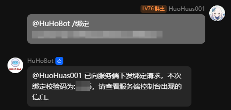
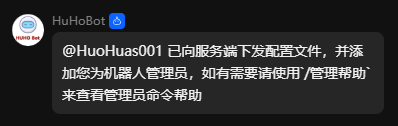

# 快速开始

## 🛠️ 选择适配器
**选择适合您服务器类型的适配器**：

📌 请先仔细阅读 [适配器选择指南](../Adapter/index.md) 文档，根据您的服务器类型选择正确的适配器版本

💡 **选择建议**：

- Java服务器 → 选择Spigot适配器
- 基岩版BDS → 根据服务端选择LSE或EndStone适配器
- 其他基岩版 → 参考其他适配器选项

🔗 [立即查看适配器文档](../Adapter/index.md){: .md-button }


## 1. 📥 安装插件

### 🖥️ Java类核心(Spigot/Nukkit/Allay)安装 (JAR文件)
```bash
步骤：
1. 下载`HuHoBot-XX-X.X.X.jar`文件
2. 放入服务器的`plugins`文件夹
3. 重启/启动服务器
```

### 🧱 基岩版BDS安装 (LSE-ZIP文件)
```bash
步骤：
1. 下载`HuHoBot-BDS-vX.X.X.zip`文件
2. 解压得到`HuHo_Bot`文件夹
3. 将整个文件夹放入BDS的`plugins`目录
4. 重启服务器
```

### ⚙️ EndStone服务器安装 (DLL/SO文件)
```bash
步骤：
1. 下载`endstone_huhobot_vX.X.X.dll`(Windows)或.so文件(Linux)
2. 放入服务器的`plugins`文件夹
3. 重启服务端
```

### 🔄 其他第三方适配器
请参考对应平台的插件安装文档
- 适配器列表：[适配器列表](../Adapter/Third-Party.md)

✔️ 安装完成后，控制台应显示相关加载成功的日志信息


## 2. ⚙️ 插件配置

### 📁 配置文件说明
```bash
配置文件路径：
- Java类核心(Spigot/Nukkit/Allay): plugins/HuHoBot/config.yml
- BDS服务器: plugins/HuHo_Bot/config.json
- EndStone服务器: plugins/HuHoBot/config.json
```

### 🔧 配置步骤
1. 找到上述路径的配置文件
2. 用文本编辑器打开修改
3. 保存后执行命令重载配置：
   ```bash
   /huhobot reload
   ```

🔗 [详细配置参考适配器文档](../Adapter/index.md){: .md-button }

💡 提示：

- 修改配置后建议重启服务器确保完全生效
- YAML文件需注意缩进格式
- 重要配置修改后需要重新绑定

## 3. 🤖 添加机器人到QQ群

### 📌 添加前准备
- 您需要有目标QQ群的管理员权限

### 🔗 添加步骤
1. **加入官方交流群**  
   [点击加入HuHoBot交流群](http://qm.qq.com/cgi-bin/qm/qr?_wv=1027&k=N6tVRxGR8sDwYHBx9YgAhkqRTp1gseyk&authKey=M7Fd3Op6nHjXjSXefBtHBPqIq2wtX8AfufZor9DrfRrJkhyS2rohkt7iuOSwbtn8&noverify=0&group_code=1005746321)

2. **将机器人添加到您的服务器群**  
   - 在交流群内的成员列表中找到HuHoBot
   - 点击`添加到群聊`并选择你需要添加的群聊

3. **验证机器人已加入**  
   ```bash
   @HuHoBot /帮助
   ```
   如果机器人正常回复，则表示添加成功

## 4. 🔗 完成服务器绑定

### 🔍 绑定前准备
- 确保机器人已加入目标QQ群
- 服务器插件已正确安装并运行

### 🛠️ 绑定流程

1. **获取绑定码**  
   在服务器控制台查找如下消息：
   ```bash
   [HuHoBot] 服务器尚未在机器人进行绑定，请在群内输入"/绑定 xxxxxxxxxxxxxxxxxxxxxxx"
   ```

2. **在QQ群发起绑定**  
   在目标QQ群中@机器人并输入：
   ```bash
   @HuHoBot /绑定 xxxxxxxxxxxxxxxxxxxxxxx
   ```
   

3. **确认绑定**  
   控制台将显示确认指令：
   ```bash
   [HuHoBot] 收到一个新的绑定请求，如确认绑定，请输入"/huhobot bind xxxx"来进行确认
   ```
   在控制台输入：
   ```bash
   huhobot bind xxxx
   ```

4. **验证绑定成功**  
    QQ群将收到绑定成功提示  
    
    
    控制台显示连接成功消息：
    ```bash
    [HuHoBot] 与服务端握手成功.
    ```

### ⚠️ 注意事项
- 一个QQ群只能绑定一个服务器，如需一个服务器绑定多个群请参照[多群绑定](../Question/index.md#_17)

### 🔧 后续操作
- 如需换绑请直接输入`/绑定`则会覆盖之前绑定的服务器
- 添加其他管理员：[管理员帮助](../AdminHelp/index.md)


